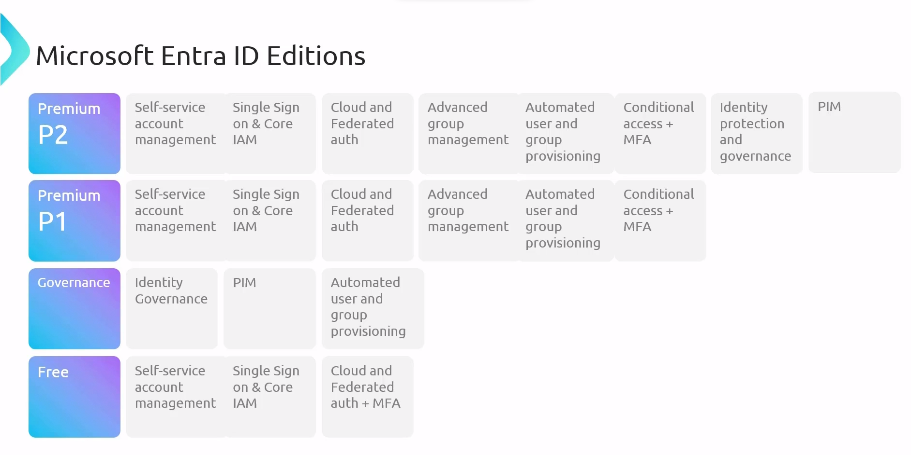

# Chapter 1: Administer Identity

---

- Microsoft Entra ID (Formerly MS Azure Active Directory)
  
  - Microsoft Entra ID has four Tier License model i.e. Premium P1, Premium P2, Governance and Free 
    
    
  
  - Microsoft Entra ID enforce users authentication and authorization in Microsoft Azure Portal.
  
  - User accounts and user devices can be categorized in groups. Non Azure users can be invited and added as a guest. On-prem Active Directory users can also be part of the Azure by using Active Directory Domain Service.
  
  - User creation, deletion can be done in bulk.
  
  - Users can reset own password without the help of the Azure Administrator using Self Service Password Reset (SSPR).

- 
