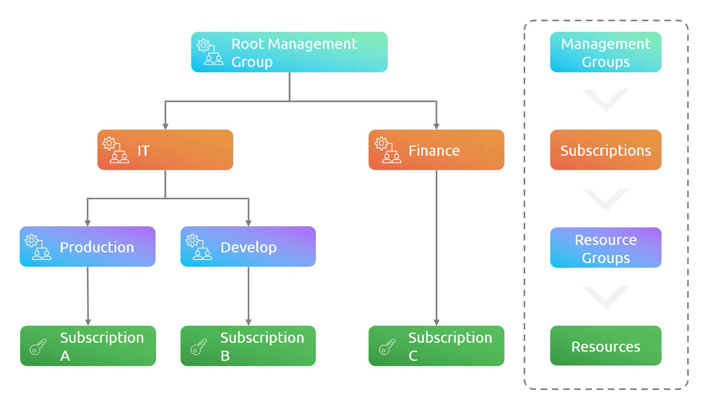

# # Chapter 2: Administer Governance and Compliance

---

- **Subscription Types**
  
  - Enterprise Agreements (Upfront Payment to Microsoft needed)
  
  - Pay-as-You-GO (Most expensive in long-run)
  
  - Cloud Solution Provider (Need to be purchased from Vendor Partners)
  
  - Free Trial
  
  - Azure for Students (Need to be proved as a student)
  
  - Visual Studio or MSDN subscription (Best for developers)
  
  However, apart from these major types of subscription Microsoft offers numerous other Azure offers for different regions and use case.

- **Resource Group and Limits**
  
  - Resources can be created under a Resource Group and can also be moved to another group. However, name of a Resource Group cannot be change once it is deployed.
  
  - There are some limits of creating resources in each region as well as by each user to avoid service downtime and unusual surge in bill.

- **Hierarchy**
  
  - Hierarchy helps to create policies and also helps to understand the workflow
  
  - Management Groups > Subscriptions > Resource Groups > Resources
  
  - 

- **Resource Tags**
  
  - Helpful to manage the resources as well as manage the cost.
  
  - Resources can be easily identified if proper tagging is used.
  
  - Resource Tags don't don't get inherited which means if a tag is given on a Resource Groups then tags are not inherited to resources.

- **Resource Locks**
  
  - Useful to avoid accidental changes.
  
  - Resource Locks inherit to the lower scopes
  
  - There are 2 types of locks i.e. **Read-only Locks** and **Delete Locks**

- **Cost Saving Techniques**
  
  - Azure Reserved Instances (RI) -- Reserve Resouces for 1 year or 3 years
  
  - Azure Hybrid Benefit (AHUB) -- On-prem Licenses can be used in Azure
  
  - Choose low cost regions

- **Azure Policy**
  
  - Using policy Azure Administrator can define and enforce different organizational standards and identify non-complaint resources.
  
  - Policies are written in a JSON definition file.
  
  - Few use cases of policy are
    
    - Require Tags
    
    - Inherit Tags
    
    - Allowed Locations
    
    - Allowed Virtual Machine SKUs
    
    - Allowed Resource Group Locations
    
    - Allowed Resources Types

- **Initiatives**
  
  - 
