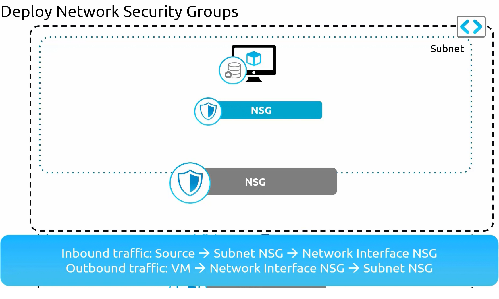
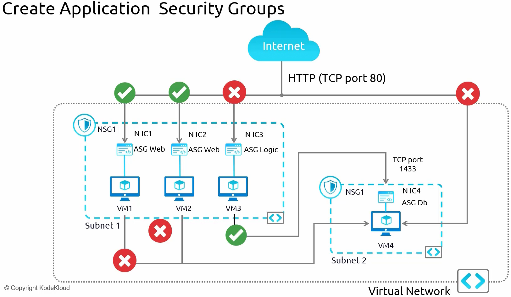

# Chapter 4: Administer Virtual Networking

---

- Network in Azure is consist of Virtual Networks (VNETs). Each VNET can be divided in subnets. Each region can have multiple VNETs.

The thumb rule is ***do not let your address space overlap with other Virtual Network (VNET) address spaces or your on-premises address space**.*

- Public and Private IP address have 2 different SKUs which are BASIC and STANDARD.
  
  

- **Network Security Groups (NSG)**
  
  - There are 2 types of Network Security Group which are
    
    - Network Interface Card (NIC) Network Security Group (Works at Layer 1).
    
    - Subnet Network Security Group (Works at Layer 4).
    
    - Outbound rule is created automatically after Inbound rule creation.

- **Application Security Groups (ASG)**
  
  - Application security group works at application layer (Layer 7).

