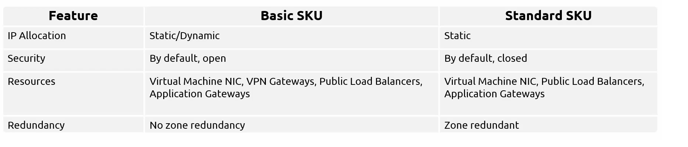

# Chapter 4: Administer Virtual Networking

---

- Network in Azure is consist of Virtual Networks (VNETs). Each VNET can be divided in subnets. Each region can have multiple VNETs.

The thumb rule is ***do not let your address space overlap with other Virtual Network (VNET) address spaces or your on-premises address space**.*

- Public and Private IP address have 2 different SKUs which are BASIC and STANDARD.
  
  
